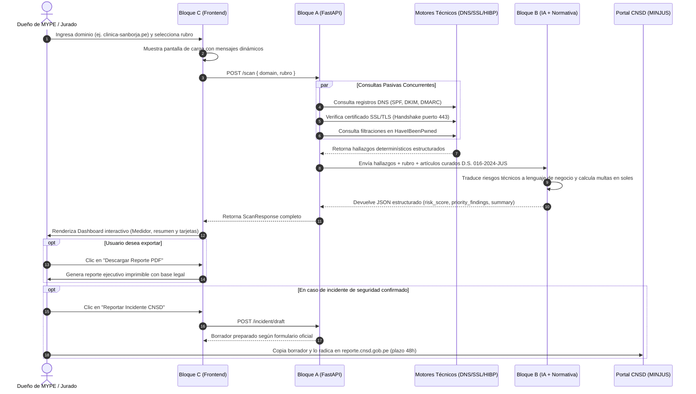

# Arquitectura Técnica del Sistema UYW4Q

Este documento detalla la interconexión integral entre el **Bloque A** (Backend y Motor de Escaneo), el **Bloque B** (Inteligencia Artificial y Normativa D.S. 016-2024-JUS) y el **Bloque C** (Frontend y Experiencia de Usuario), coordinados bajo los lineamientos de integración y QA del **Bloque D**.

---

## 1. Diagrama de Conectividad General (A + B + C + Servicios Externos)

```mermaid
flowchart TD
    subgraph Bloque_C["Bloque C: Frontend (React + Vite + Tailwind)"]
        UI_Landing["1. Landing Page (Dominio + Rubro)"]
        UI_Loading["2. Pantalla de Carga Interactiva"]
        UI_Dashboard["3. Dashboard de Resultados (Medidor de Riesgo)"]
        UI_Modal["4. Detalle de Hallazgos"]
        UI_Report["5. Exportación de Reporte PDF"]
        UI_CNSD["6. Asistente Notificación CNSD (48h)"]
    end

    subgraph Bloque_A["Bloque A: Backend & Motor de Escaneo (FastAPI)"]
        API_Scan["POST /scan & GET /scan/{id}"]
        API_Incident["POST /incident/draft"]
        DNS_Engine["dns_checks.py (SPF, DKIM, DMARC, MX)"]
        SSL_Engine["ssl_checks.py (Cifrado, Vigencia, Emisor)"]
        Breach_Engine["breach_check.py (HIBP / Mock)"]
        Deterministic_Scoring["risk_scoring.py (Puntaje Heurístico Base)"]
        DB_Store["supabase_client.py (Postgres / In-Memory Fallback)"]
    end

    subgraph Bloque_B["Bloque B: IA & Normativa D.S. 016-2024-JUS"]
        KB_Legal["normativa_ds016.json (Artículos 38, 39, 42, 45 + Escala Multas)"]
        KB_Casos["casos_peru.json (Interbank, Topitop, UPC)"]
        Prompt_Builder["prompt_builder.py (Inyección Contextual)"]
        LLM_Client["llm_client.py (Gemini / OpenAI / Mock Offline)"]
        Parser["response_parser.py (Validación JSON Estructurado)"]
        Incident_Gen["incident_template.py (Formulario Virtual CNSD)"]
    end

    subgraph External["Servicios Externos & Autoridades"]
        DNS_Public["Servidores DNS Públicos"]
        Host_443["Puerto 443 del Dominio (Handshake SSL)"]
        HIBP_API["API HaveIBeenPwned (Breaches)"]
        Supabase_Cloud["Supabase Auth & Database"]
        CNSD_Portal["Portal Oficial CNSD (reporte.cnsd.gob.pe)"]
    end

    %% Conexiones
    UI_Landing -->|Envía dominio y rubro| API_Scan
    API_Scan --> DNS_Engine
    API_Scan --> SSL_Engine
    API_Scan --> Breach_Engine

    DNS_Engine -.->|Consultas pasivas TXT/MX| DNS_Public
    SSL_Engine -.->|Handshake pasivo puerto 443| Host_443
    Breach_Engine -.->|Consulta de filtraciones| HIBP_API

    DNS_Engine --> Deterministic_Scoring
    SSL_Engine --> Deterministic_Scoring
    Breach_Engine --> Deterministic_Scoring

    Deterministic_Scoring --> Prompt_Builder
    KB_Legal --> Prompt_Builder
    KB_Casos --> Prompt_Builder

    Prompt_Builder --> LLM_Client
    LLM_Client --> Parser
    Parser --> API_Scan

    API_Scan --> DB_Store
    DB_Store -.-> Supabase_Cloud

    API_Scan -->|JSON Estructurado Consolidado| UI_Dashboard
    UI_Dashboard --> UI_Modal
    UI_Dashboard --> UI_Report
    UI_Dashboard --> UI_CNSD

    UI_CNSD -->|Datos de Incidente| API_Incident
    API_Incident --> Incident_Gen
    Incident_Gen -->|Borrador Formateado| UI_CNSD
    UI_CNSD -.->|Radicación Manual por el Titular| CNSD_Portal
```

---

## 2. Flujo de Datos Secuencial (End-to-End)

---

## 3. Principio Técnico-Jurídico Rector: Escaneo 100% Pasivo

En riguroso cumplimiento de la **Ley N° 30096 (Ley de Delitos Informáticos del Perú)**:
- **Prohibido:** NUNCA se ejecutan escaneos de puertos activos (Nmap/port scanning), inyecciones de código ni intentos de acceso no autorizado a los servidores del cliente.
- **Permitido:** El sistema consulta únicamente información pública de acceso libre:
  1. Registros DNS autoritativos públicos (TXT, MX).
  2. Parámetros del certificado público expuesto en el puerto estándar 443 (HTTPS).
  3. Bases de datos de filtraciones públicas previamente divulgadas en repositorios conocidos.
- **Descargo de Responsabilidad Obligatorio:** Todos los reportes generados contienen la advertencia expresa: *"Diagnóstico orientativo, no dictamen legal vinculante conforme al D.S. 016-2024-JUS."*
